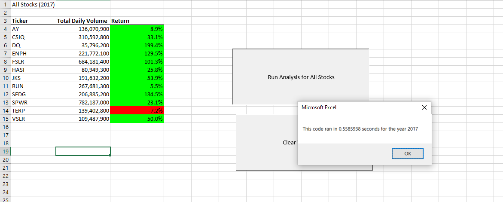
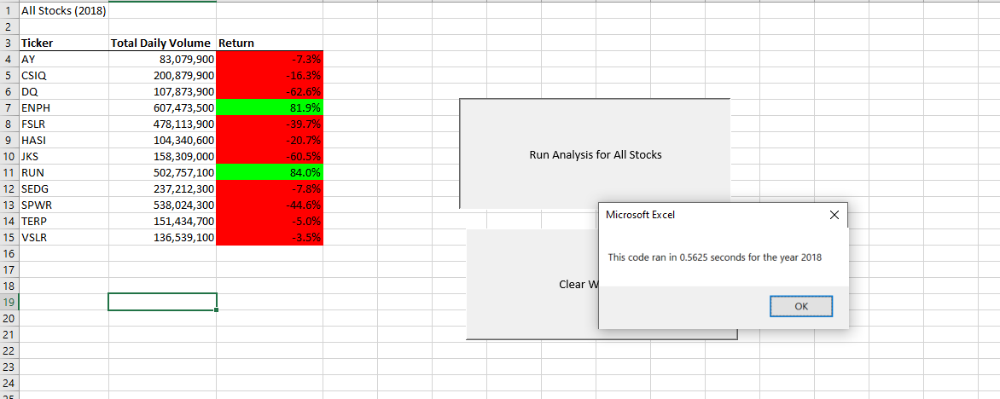

#### stock-analysis

### Purpose

        The purpose of this Analysis was both to create a dynamic model capable of analyzing
        certain metrics for numerous stocks. This allows for easy comparison of metrics
        across companies. Furthermore, this analysis sought to highlight the benifits of refactoring code, 
        and how that impacts the speed of analysis. With a relatively small dataset such as the one used in 
        this analysis the difference may be quite small, but when working with larger datasets, the time saved
        by refactoring code     
       

## Results

        Green stocks performed much better in 2018 than in 2017. Refactoring the code made the script's excecution 
        far more efficient. The time it took to make the calculations for the metrics of these stocks was cut almost in
        half. With a datase of fairly small size such as the one we are working with, the difference in time is not overly
        significant, but when larger datasets need to be used, the time saved by refactoring begins to make a big difference.
        

# Summary
       Advantages of refactoring code include mental and time-based efficiencies. If one can recognize a pattern
       for acheiving a goal in analysis, there is no reason to re-do any unneccesary work. However, it is important
       to remember that it is unlikely that the code you are trying to use will not need to be changed, or refactored,
       in some way. It is easier to gloss over small details when refactoring code, and some mistakes may be overlooked
       or efficiencies lost when refactoring rather than creating one's own code. 
 
